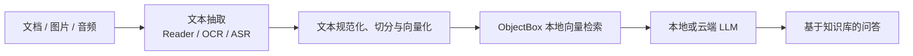

# OmniEdge

> 基于 [shubham0204/OnDevice-RAG-Android](https://github.com/shubham0204/OnDevice-RAG-Android) 的二次开发项目：面向 Android 的离线优先多模态 RAG 知识库。

OmniEdge 将文档、图片和音频中的内容统一抽取为文本，完成切分、端侧向量化和本地检索，再将相关上下文交给本地或云端 LLM 生成回答。项目重点探索移动端多模态内容入库、离线处理与可控的数据生命周期。

> [!NOTE]
> 本项目的“多模态”指文档、图片和音频统一完成**文本抽取、索引与检索**；不包含图片向量检索、视觉问答、视频理解或声纹识别。

## 项目亮点

- **多源知识导入**：支持 PDF、DOCX、Markdown、纯文本、图片、扫描型 PDF 与音频。
- **离线中文 OCR**：图片使用 ML Kit 捆绑中文文本识别；扫描型 PDF 会优先提取原始文本，文本不足时才逐页 OCR。
- **离线中文音频转写**：通过 Android 平台解码与 Vosk 将音频转为可检索文本；模型由用户主动下载、校验并可取消。
- **端侧 RAG 链路**：文本切分与 `all-MiniLM-L6-V2` 向量化在设备侧完成，使用 ObjectBox 进行向量检索。
- **统一导入与一致性**：文档、图片和音频复用统一入库编排；抽取、嵌入全部完成后再原子写入来源及其 Chunk，失败或取消不会留下半完成索引。
- **本地与云端问答**：可使用本地模型，也可配置 Gemini 进行基于检索上下文的问答。

## 工作流程



## 能力矩阵

| 输入类型 | 处理方式 | 当前状态 |
| --- | --- | --- |
| PDF / DOCX / Markdown / TXT | 既有 Reader 抽取文本并索引 | 已支持 |
| 图片 | 离线中文 OCR 后索引 | 已支持 |
| 扫描型 PDF | 原始文本不足时逐页 OCR 回退 | 已支持 |
| 音频 | Android 平台解码 + Vosk 中文转写后索引 | 已支持；格式以真机验证为准 |
| 图片语义检索 / 视觉问答 | 图像嵌入模型 | 暂不支持 |
| 视频导入 / 实时录音 / 声纹识别 | 专用媒体处理链路 | 暂不支持 |

## 快速开始

### 环境要求

- Android Studio（使用项目指定的 JDK 21）
- Android SDK：`compileSdk 35`，`minSdk 26`
- 一台 Android 真机或模拟器

### 构建并运行

```bash
git clone https://github.com/Fantto00/OmniEdge.git
cd OmniEdge
./gradlew :app:assembleDebug
```

也可以直接使用 Android Studio 打开项目并运行 `app` 配置。

### 使用知识库

1. 在文档页面从系统选择器导入文档或图片；应用会抽取文本、切分并写入本地知识库。
2. 导入扫描型 PDF 时，应用会先尝试常规文本提取；文本不足时才启用页级 OCR 回退。
3. 使用音频前，先在文档页面主动执行 **Set Up Chinese ASR**，等待模型下载、完整性校验和安装完成；随后选择音频并导入知识库。
4. 在聊天页面选择本地模型，或配置 Gemini API Key 后发起提问。

> [!IMPORTANT]
> 不要将 Gemini API Key、Hugging Face Token、签名密钥或用户媒体提交到仓库。

## 隐私与离线策略

- 图片使用离线中文 OCR 模型，不依赖首次识别时下载的动态模型。
- 音频转写模型不随 APK 打包，也不会在应用启动时静默下载；下载由用户明确触发，并进行 HTTPS、大小和 SHA-256 校验。
- 图片通过 Photo Picker、音频通过 Storage Access Framework 选择，不为导入请求广泛媒体读取权限。
- 原始图片和音频不复制到应用持久目录；知识库持久化的是用于检索的文本与必要来源元数据。
- 云端问答仅在你主动配置并选择 Gemini 时发生；其余抽取、向量化与检索均在设备侧执行。

## 技术栈

| 领域 | 组件 |
| --- | --- |
| UI 与架构 | Kotlin、Jetpack Compose、Koin、Coroutines |
| 文档解析 | Apache POI、iTextPDF |
| 图片 OCR | ML Kit Chinese Text Recognition（捆绑模型） |
| 音频转写 | Android `MediaExtractor` / `MediaCodec`、Vosk |
| 文本向量化 | ONNX Runtime、`all-MiniLM-L6-V2` |
| 本地检索 | ObjectBox Vector Search |
| 问答模型 | MediaPipe LLM Inference、Gemini SDK |

## 已知限制

- 音频转写当前限制为最长 5 分钟；MP3、M4A/AAC、WAV 等格式是否可用取决于目标设备和实际文件，应以真机测试结果为准。
- Vosk 中文小模型适合短音频和移动端试验，转写质量会受录音质量、噪声和设备资源影响。
- 当前嵌入模型标注为英文模型；中文 OCR/ASR 内容的检索质量需要通过 Recall@5、首条命中率和端到端延迟等基准持续验证。
- 大图片、扫描 PDF 的页数与像素、音频时长均受限，以避免内存压力和长时间阻塞。

## 致谢

OmniEdge 基于 [shubham0204/OnDevice-RAG-Android](https://github.com/shubham0204/OnDevice-RAG-Android) 二次开发，并在其 Android 端侧 RAG 基础上扩展了统一导入、中文 OCR、扫描 PDF OCR 回退和离线音频转写能力。感谢原项目及其依赖社区提供的工作基础。

## 许可证

本项目遵循 [Apache License 2.0](./LICENSE)。请保留原项目及第三方依赖的版权和许可证声明。
