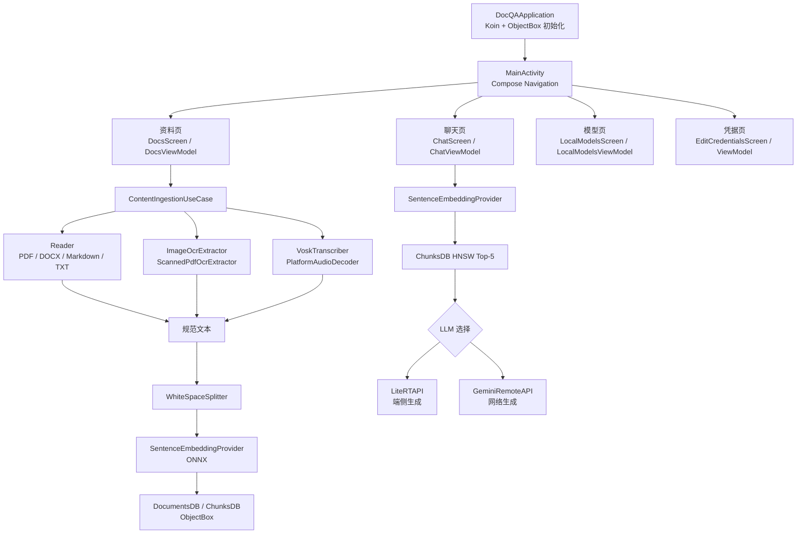
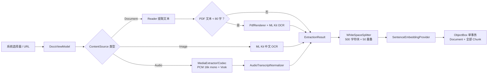
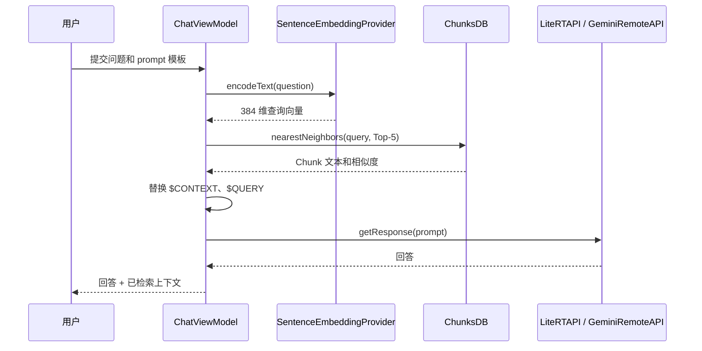
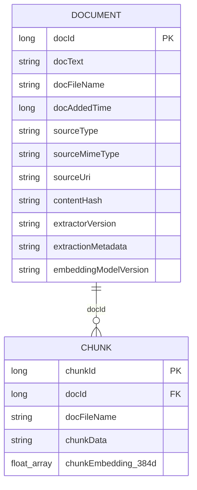

# OmniEdge 项目介绍与架构审阅

> 审阅基线：当前 `main` 工作区；本文依据 `app/src/main` 中 52 个 Kotlin 源文件、Gradle 配置和已有多模态实施契约整理。本文描述的是代码当前行为，不把设计目标当作已验证的设备能力。

## 1. 项目是什么

OmniEdge 是一个单模块 Android/Compose RAG 应用。它把文档、图片和音频统一抽取为文本，在设备上完成文本切分、`all-MiniLM-L6-V2` 向量化和 ObjectBox 近邻检索；再把检索到的上下文交给已加载的本地 LiteRT 模型，或已配置密钥的 Gemini，生成问答结果。

“多模态”在本项目中指**多种输入先转为文本，再进入同一检索链路**，而不是图像向量检索、视觉问答、视频理解或声纹识别。

| 维度 | 当前实现 |
| --- | --- |
| Android 基线 | Kotlin、Compose、minSdk 26、target/compileSdk 35、Java/Kotlin 21 |
| 架构方式 | 单 `app` 模块；Compose + ViewModel + Koin；领域能力以 `@Single` 注入 |
| 本地数据 | ObjectBox `Document` 和 `Chunk` 实体；`Chunk` 建有 384 维 HNSW 向量索引 |
| 本地嵌入 | assets 中的 ONNX `all-MiniLM-L6-V2` + tokenizer，经 ONNX Runtime / Sentence-Embeddings AAR 运行 |
| 文档输入 | PDF、DOCX、Markdown、纯文本，以及 URL 下载后的同类文档 |
| 多模态输入 | ML Kit 中文 OCR（图片及扫描 PDF 回退）；Android 解码 + Vosk 中文 ASR（音频） |
| 问答输出 | MediaPipe LiteRT 本地模型，或 Gemini 远程模型 |

## 2. 总体结构



### 包与职责边界

```text
com.ml.shubham0204.docqa
├── data/              ObjectBox 实体、数据库访问、密钥和本地模型元数据
├── di/                Koin 注入入口
├── domain/
│   ├── readers/       传统文档文本提取
│   ├── ingestion/     统一内容来源、抽取结果、OCR/扫描 PDF 与原子入库编排
│   ├── asr/           音频解码、Vosk 转写和模型安装
│   └── llm/           本地/远程 LLM 适配
└── ui/
    ├── components/    共享弹窗与进度弹窗
    ├── screens/       聊天、资料、模型、凭据页面与各自 ViewModel
    └── theme/         Material 3 配色与字体
```

## 3. 两条核心运行链路

### 3.1 导入与索引



`ContentIngestionUseCase` 是统一入口：抽取失败、空文本、切分失败、嵌入失败或协程取消发生在写入前，因此不会写出半完成的资料。`DocumentsDB.addDocumentAndChunks()` 再以 ObjectBox 事务把资料和全部块一起写入。

### 3.2 问答与检索



## 4. 端侧与联网边界

| 能力 | 默认执行位置 | 联网条件与说明 |
| --- | --- | --- |
| PDF/DOCX/Markdown/TXT 提取 | 端侧 | URL 导入时只下载原文件；解析在本地 |
| 图片 OCR | 端侧 | 使用 `text-recognition-chinese` 捆绑依赖；识别代码不发起网络请求 |
| 扫描 PDF OCR | 端侧 | Android `PdfRenderer` 渲染，复用本地 OCR |
| 音频转写 | 端侧 | Vosk 识别、MediaCodec 解码均本地；首次手动配置时下载 Vosk 模型 |
| 向量化、检索 | 端侧 | ONNX 嵌入 + ObjectBox HNSW 均本地 |
| 本地问答 | 端侧 | 先从 Hugging Face 手动下载 LiteRT 模型，再由 MediaPipe 推理 |
| Gemini 问答 | 云端 | 用户保存 API Key 后，问题和检索上下文会发送给 Gemini |

> [!IMPORTANT]
> `AndroidManifest.xml` 声明了 `INTERNET`，且 `usesCleartextTraffic="true"`。前者对 URL、模型下载和 Gemini 是必要条件；后者扩大明文流量暴露面，但当前资料/模型下载代码分别使用 `HttpURLConnection`、HTTPS Vosk URL 和 HTTPS Hugging Face URL。是否关闭明文流量应在单独的兼容性验证后处理。

## 5. 功能与限制

| 功能 | 实现 | 明确限制 |
| --- | --- | --- |
| 图片文字 | 图片选择器 + ML Kit 中文 OCR | 最大 16 MP |
| 扫描 PDF | 普通 PDF 提取优先，文本不足时页级 OCR | 最多 10 页、最长边 2048 px、总计 40 MP、60 秒 |
| 音频文字 | 平台解码为 PCM-16LE、16 kHz、单声道，再送 Vosk | 最长 5 分钟；仅单/双声道；格式以目标设备 `MediaCodec` 支持为准 |
| ASR 模型安装 | Ketch 下载、大小/SHA-256 校验、安全解压、加载校验、原子安装到 `noBackupFilesDir` | 下载包最多 60 MiB、解压最多 160 MiB，要求至少 256 MiB 可用空间 |
| 中文检索 | 中文无空白文本按句末符优先切分 | 现有嵌入模型为 `all-MiniLM-L6-V2`；中文 Recall@5、首条命中率和端到端延迟仍应持续实测 |

## 6. 类型与类职责清单

下表覆盖应用源代码中的顶层类、对象、接口、枚举和直接服务于界面的状态/事件类型；私有 Compose 辅助函数不作为“类”重复计数。

### 6.1 启动、导航与依赖注入

| 类型 | 位置 | 职责 |
| --- | --- | --- |
| `DocQAApplication` | `DocQAApplication.kt` | Application 入口；启动 Koin 并初始化 ObjectBox。 |
| `MainActivity` | `MainActivity.kt` | 唯一 Activity；开启 edge-to-edge，挂载 Compose `NavHost` 并将 ViewModel 状态传给页面。 |
| `ChatRoute` | `MainActivity.kt` | 可序列化的聊天路由标识。 |
| `EditAPIKeyRoute` | `MainActivity.kt` | 可序列化的凭据页路由标识。 |
| `DocsRoute` | `MainActivity.kt` | 可序列化的资料页路由标识。 |
| `LocalModelsRoute` | `MainActivity.kt` | 可序列化的本地模型页路由标识。 |
| `AppModule` | `di/AppModule.kt` | Koin 注解模块；提供 `ContentResolver`，并扫描应用包内的注解服务。 |

### 6.2 数据、本地持久化与凭据

| 类型 | 位置 | 职责 |
| --- | --- | --- |
| `ObjectBoxStore` | `data/ObjectBoxStore.kt` | 保存全局 `BoxStore`，由 Application 在启动时创建。 |
| `Document` | `data/DataModels.kt` | ObjectBox 资料实体；保存规范化文本、来源类型/MIME/URI、哈希、抽取与嵌入版本元数据。 |
| `Chunk` | `data/DataModels.kt` | ObjectBox 文本块实体；以 `docId` 关联资料，并在 `chunkEmbedding` 上建立 384 维 HNSW 索引。 |
| `RetrievedContext` | `data/DataModels.kt` | 聊天页面展示的检索结果值对象（文件名、块文本）。 |
| `DocumentsDB` | `data/DocumentsDB.kt` | 资料仓储；事务性新增/删除资料及其 Chunk，暴露资料列表 Flow 与计数。 |
| `ChunksDB` | `data/ChunksDB.kt` | Chunk 仓储；写入单个块、删除某资料块、按嵌入向量进行近邻检索。 |
| `GeminiAPIKey` | `data/GeminiAPIKey.kt` | 借助 `EncryptedSharedPreferences` 保存/读取 Gemini API Key。 |
| `HFAccessToken` | `data/HFAccessToken.kt` | 借助 `EncryptedSharedPreferences` 保存/读取 Hugging Face Token。 |
| `LocalModel` | `data/LocalModel.kt` | 本地 LLM 的名称、描述、下载地址与加载状态；计算落盘路径并检查是否已下载。 |

### 6.3 通用文本处理与传统文档 Reader

| 类型 | 位置 | 职责 |
| --- | --- | --- |
| `SentenceEmbeddingProvider` | `domain/SentenceEmbeddingProvider.kt` | 从 assets 复制 ONNX 模型与 tokenizer 到私有存储，初始化 Sentence-Embeddings，并把文本编码为向量。 |
| `WhiteSpaceSplitter` | `domain/WhiteSpaceSplitter.kt` | 文本切分器；含空白文本按词切分，无空白文本按中英文句末符尽量断句，并生成相邻重叠块。 |
| `Reader` | `domain/readers/Reader.kt` | 同步文档读取抽象，定义 `readFromInputStream`。 |
| `Readers` | `domain/readers/Readers.kt` | Reader 工厂；按 `DocumentType` 选择对应实现。 |
| `Readers.DocumentType` | `domain/readers/Readers.kt` | 枚举 PDF、DOCX、纯文本、Markdown，并通过扩展函数映射 MIME。 |
| `PDFReader` | `domain/readers/PDFReader.kt` | 使用 iText `PdfTextExtractor` 逐页提取内嵌 PDF 文本。 |
| `DOCXReader` | `domain/readers/DOCXReader.kt` | 使用 Apache POI 读取 DOCX 段落并串接为文本。 |
| `MarkdownReader` | `domain/readers/MarkdownReader.kt` | 读取 Markdown 并用正则移除代码块、图片、链接地址与常见标记，保留可索引正文。 |
| `TextFileReader` | `domain/readers/TextFileReader.kt` | 原样读取 UTF 文本文件。 |

### 6.4 统一导入、OCR 与扫描 PDF

| 类型 | 位置 | 职责 |
| --- | --- | --- |
| `ContentSource` | `domain/ingestion/ContentSource.kt` | 统一来源密封接口，约束 URI、显示名、MIME、原始来源地址和来源类型。 |
| `ContentSource.Document` | 同上 | 文档来源，额外持有 `DocumentType`。 |
| `ContentSource.Image` | 同上 | 图片来源。 |
| `ContentSource.Audio` | 同上 | 音频来源。 |
| `SourceType` | 同上 | `DOCUMENT`、`IMAGE`、`AUDIO` 的来源分类枚举。 |
| `ExtractionResult` | `domain/ingestion/ExtractionResult.kt` | 抽取层返回值：文本、来源/MIME、抽取器 ID/版本及诊断元数据。 |
| `IngestionResult` | 同上 | 入库成功结果：资料 ID 与 Chunk 数。 |
| `ContentIngestionUseCase` | `domain/ingestion/ContentIngestionUseCase.kt` | 导入编排核心：选择 Reader/OCR/ASR，检查空文本，切分、嵌入，并经 `DocumentsDB` 原子写入。 |
| `ImageOcrExtractor` | `domain/ingestion/ImageOcrExtractor.kt` | 验证图片尺寸，使用 ML Kit 中文识别器读取本地 URI 图片并生成 `ExtractionResult`。 |
| `OcrImageLimits` | `domain/ingestion/OcrImageLimits.kt` | 图片 OCR 的 16 MP 上限校验。 |
| `ScannedPdfOcrExtractor` | `domain/ingestion/ScannedPdfOcrExtractor.kt` | 以 `PdfRenderer` 逐页渲染扫描 PDF，再调用 `ImageOcrExtractor`；支持协程取消和超时。 |
| `ScannedPdfOcrLimits` | `domain/ingestion/ScannedPdfOcrLimits.kt` | 定义扫描 PDF 的回退阈值、页数、像素与时间上限，并计算降采样渲染尺寸。 |
| `AudioTranscriptNormalizer` | `domain/ingestion/AudioTranscriptNormalizer.kt` | 去除 Vosk 文本在中文字符、数字和中文标点间多余的空格，不破坏非 CJK 词边界。 |

### 6.5 离线语音识别（ASR）

| 类型 | 位置 | 职责 |
| --- | --- | --- |
| `AudioPocLimits` | `domain/asr/AudioPocLimits.kt` | 定义 ASR POC 的目标 PCM（16 kHz、单声道）及 5 分钟/最大 PCM 大小限制。 |
| `DecodedAudio` | `domain/asr/PlatformAudioDecoder.kt` | 解码结果值对象：MIME、声明时长、归一化后时长。 |
| `PlatformAudioDecoder` | `domain/asr/PlatformAudioDecoder.kt` | 用 `MediaExtractor` 找音轨、`MediaCodec` 流式解码，并持续回调归一化 PCM；负责释放编解码资源。 |
| `Pcm16MonoNormalizer` | `domain/asr/Pcm16MonoNormalizer.kt` | 流式把 PCM-16LE 的单/双声道与任意采样率转为 Vosk 所需 16 kHz 单声道。 |
| `SpeechModelConfig` | `domain/asr/SpeechModelConfig.kt` | 固化 Vosk 中文模型 ID、下载地址、SHA-256、存储及解压限制。 |
| `SpeechModelArchive` | `domain/asr/SpeechModelArchive.kt` | 校验 ZIP 条目最终路径位于目标目录内，阻止 Zip Slip。 |
| `SpeechModelManager` | `domain/asr/SpeechModelManager.kt` | 负责用户触发的 Vosk 模型下载、取消、校验、解压、加载验证和原子安装。 |
| `AudioTranscriptionPocResult` | `domain/asr/VoskTranscriber.kt` | 转写结果值对象：文本、MIME、音频时长和处理耗时。 |
| `VoskTranscriber` | `domain/asr/VoskTranscriber.kt` | 加载已安装模型，接收解码 PCM，调用 Vosk `Recognizer`，产出最终中文转写。 |

### 6.6 LLM 抽象与实现

| 类型 | 位置 | 职责 |
| --- | --- | --- |
| `LLMInferenceAPI` | `domain/llm/LLMInferenceAPI.kt` | 问答模型统一抽象，定义挂起式 `getResponse(prompt)`。 |
| `LiteRTAPI` | `domain/llm/LiteRTAPI.kt` | 通过 MediaPipe `LlmInference` 加载、运行、卸载本地 `.task` 模型；记录当前模型路径。 |
| `LiteRTAPI.PartialProgressListener` | 同上 | MediaPipe 流式回调适配器，累积部分输出并在结束时返回完整结果。 |
| `GeminiRemoteAPI` | `domain/llm/GeminiRemoteAPI.kt` | 使用保存的 API Key 构建 `gemini-2.5-flash` 客户端，以固定 temperature/topP 和系统提示词生成远程回答。 |

### 6.7 聊天界面与状态模型

| 类型 | 位置 | 职责 |
| --- | --- | --- |
| `ChatScreen` | `ui/screens/chat/ChatScreen.kt` | Compose 聊天页面；展示问题、答案、检索上下文，提供输入、分享和更多菜单。 |
| `ChatScreenMoreOptionsPopup` | `ui/screens/chat/ChatScreenMoreOptionsPopup.kt` | 更多菜单 Compose 组件，发送跳转到凭据、模型、资料页的事件。 |
| `ChatViewModel` | `ui/screens/chat/ChatViewModel.kt` | 校验资料/问题/模型状态；生成查询向量、取 Top-5 Chunk、组装 prompt，调度本地或 Gemini 问答并管理 UI 状态。 |
| `ChatScreenUIEvent` | 同上 | 密封 UI 事件，包括跳转事件和回答生成事件。 |
| `ChatScreenUIEvent.ResponseGeneration` | 同上 | `Start`、`StopWithSuccess`、`StopWithError` 三种回答生命周期事件。 |
| `ChatNavEvent` | 同上 | 密封导航事件：无操作、到凭据、到资料、到本地模型页。 |
| `ChatScreenUIState` | 同上 | 聊天页面不可变状态：问题、回答、生成标记、检索上下文。 |

### 6.8 资料导入界面与状态模型

| 类型 | 位置 | 职责 |
| --- | --- | --- |
| `DocsScreen` | `ui/screens/docs/DocsScreen.kt` | Compose 资料页；列出资料，发起本地/URL 文档、图片和音频的选择、查看、分享、删除及 ASR 设置。 |
| `DocsViewModel` | `ui/screens/docs/DocsViewModel.kt` | 后台调用统一导入、管理资料列表、URL 缓存下载、ASR 模型配置、音频 POC/入库任务、取消和进度本地化。 |
| `DocsScreenUIEvent` | 同上 | 密封事件：选择各类来源、提交 URL、删除资料、模型设置、取消和提示确认。 |
| `DocDownloadState` | 同上 | URL 文档下载状态枚举：无、进行中、成功、失败。 |
| `SpeechModelUIState` | 同上 | ASR 模型设置状态：文本、忙碌、已就绪。 |
| `AudioPocUIState` | 同上 | 音频离线转写试验的状态与转写预览。 |
| `AudioImportUIState` | 同上 | 音频加入知识库任务的状态。 |
| `DocsScreenUIState` | 同上 | 资料页聚合状态：资料列表、下载、提示、ASR 模型、音频 POC 和入库状态。 |
| `DocumentSourcePresentation` | `ui/screens/docs/DocumentSourcePresentation.kt` | 把持久化来源类型映射成 UI 文案资源 ID。 |

### 6.9 模型/凭据界面、共享组件与主题

| 类型 | 位置 | 职责 |
| --- | --- | --- |
| `LocalModelsScreen` | `ui/screens/local_models/LocalModelsScreen.kt` | Compose 模型列表页；显示下载、加载状态并弹出进度对话框。 |
| `DownloadDialogModel` | `ui/screens/local_models/DownloadModelDialog.kt` | 本地模型下载进度 Compose 对话框。 |
| `LocalModelsViewModel` | `ui/screens/local_models/LocalModelsViewModel.kt` | 维护候选模型清单；检查远程模型大小/空间/访问令牌，下载 `.task` 文件并加载到 LiteRT。 |
| `LocalModelsUIEvent` | `ui/screens/local_models/LocalModelsViewModel.kt` | 密封事件：下载、使用模型、刷新列表。 |
| `LocalModelsUIState` | 同上 | 模型列表及下载弹窗状态容器。 |
| `DownloadModelDialogUIState` | 同上 | 下载弹窗可见性、进度显示和百分比。 |
| `DownloadPrecheckError` | 同上 | 下载前检查错误：空间不足、需 HF Token、模型大小未知、可用空间未知。 |
| `EditCredentialsScreen` | `ui/screens/edit_credentials/EditCredentialsScreen.kt` | Compose 凭据页，用于编辑并保存 Gemini Key 与 Hugging Face Token。 |
| `EditCredentialsViewModel` | `ui/screens/edit_credentials/EditCredentialsViewModel.kt` | 凭据页的薄 ViewModel，转发两个安全存储服务的读写操作。 |
| `AppAlertDialog` | `ui/components/AppAlertDialog.kt` | 可组合通用确认/取消弹窗，与下述工厂函数共同使用。 |
| `AppProgressDialog` | `ui/components/AppProgressDialog.kt` | 可组合全局进度弹窗。 |
| `DocQATheme` | `ui/theme/Theme.kt` | Material 3 主题入口，根据系统深色模式选用配色。 |
| `Color.kt` 中颜色值 | `ui/theme/Color.kt` | 主题使用的浅/深色调色板常量。 |
| `Type.kt` 中 `Typography` | `ui/theme/Type.kt` | Material 3 字体排版定义。 |

## 7. 数据模型和生命周期



- 新增：先完成抽取、切分和每个 Chunk 的向量化，再用一个 ObjectBox 事务写入 `Document + Chunk[]`。
- 删除：`DocumentsDB.removeDocumentAndChunks` 在同一事务内先删关联 Chunk，再删 Document。
- 检索：`ChunksDB.getSimilarChunks` 对 `chunkEmbedding` 做 HNSW 近邻查询，动态把 `efSearch` 限制在 `max(n*5, 25)` 与总块数之间，再返回前 `n` 条。
- 可追溯性：来源类型、MIME、URI、文本 SHA-256、抽取器版本、抽取元数据、嵌入模型版本都写在 `Document`。

## 8. 审阅结论与后续关注点

### 已建立的优点

1. **导入收敛**：传统 Reader、OCR、ASR 最终都由 `ContentIngestionUseCase` 进入同一个切分、嵌入、原子写入路径。
2. **端侧优先**：OCR、ASR、嵌入、向量检索和可选的 LiteRT 问答均可不依赖云端推理。
3. **资源保护明确**：图片、扫描 PDF、音频时长和 ASR 模型压缩/解压均设置了上限；音频解码/识别实现了协程取消和资源释放。
4. **数据一致性较好**：资料与块的新增、删除均在 ObjectBox 事务内执行，避免孤儿 Chunk。
5. **凭据未明文落盘**：Gemini 与 Hugging Face 凭据使用 `EncryptedSharedPreferences`。

### 当前应如实保留的限制

1. **中文检索尚非已验收结论**：`all-MiniLM-L6-V2` 已在本地运行，但其中文召回质量需要基于 OCR/ASR 样本持续量化，而非只验证“能入库”。
2. **音频格式是设备相关能力**：代码依赖平台 `MediaExtractor`/`MediaCodec`，不应仅凭 MIME 声称所有 MP3、AAC、WAV 都稳定可用。
3. **音频链路仍带 POC 命名**：`AudioPocLimits`、`AudioTranscriptionPocResult` 和 UI 的测试入口表明，需要保留真机性能、内存和中文准确率证据。
4. **云端问答不是端侧**：选用 Gemini 时，检索上下文会作为 prompt 的一部分发送给远程服务；隐私说明必须与此保持一致。
5. **本地模型下载与 URL 导入会联网**：它们是用户显式操作；应继续保持进度、失败和取消状态可见。

## 9. 验证现状

代码库已有以下针对边界逻辑的单元测试：

- `WhiteSpaceSplitterTest`
- `Pcm16MonoNormalizerTest`
- `SpeechModelArchiveTest`
- `AudioTranscriptNormalizerTest`
- `OcrImageLimitsTest`
- `ScannedPdfOcrLimitsTest`
- `DocumentSourcePresentationTest`

本文仅为代码审阅与说明文档，未修改应用逻辑，也未重新执行 Gradle 构建或测试。功能变更时，至少应运行：

```powershell
.\gradlew.bat :app:compileDebugKotlin
.\gradlew.bat :app:testDebugUnitTest
.\gradlew.bat :app:lintDebug
```

## 10. 阅读入口

- 应用启动和导航：`DocQAApplication.kt`、`MainActivity.kt`
- 统一导入：`domain/ingestion/ContentIngestionUseCase.kt`
- 资料页面：`ui/screens/docs/DocsScreen.kt`、`DocsViewModel.kt`
- 问答编排：`ui/screens/chat/ChatViewModel.kt`
- 向量库访问：`data/DocumentsDB.kt`、`data/ChunksDB.kt`
- 多模态实施约束：`docs/multimodal-rag-development.md`

