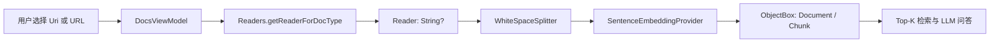
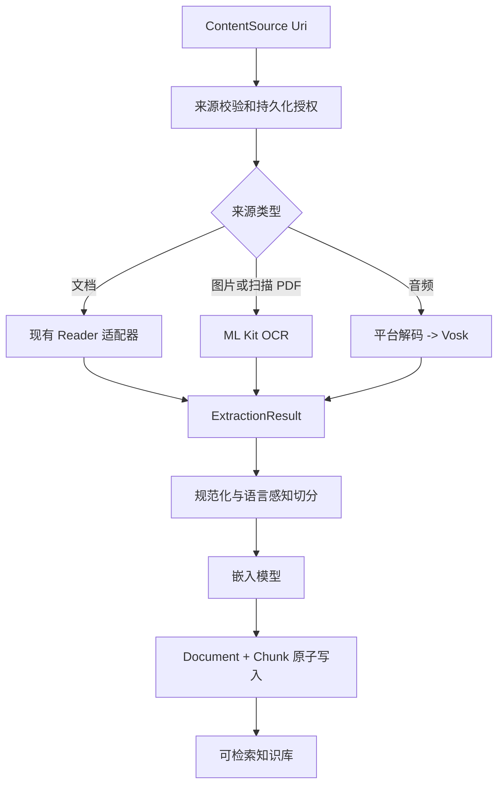

# OmniEdge 离线多模态 RAG 二次开发文档

## 1. 目的与范围

本文定义在现有 OmniEdge Android 应用上扩展“图片 OCR”和“音频转写”能力的实施基线。目标是让图片、扫描型 PDF 和音频都能转换为可检索文本，并进入已有的向量检索与问答链路。

本期的“多模态理解”指 **多种输入模态统一完成文本化、索引与检索**，并不表示直接进行图片向量检索、视觉问答或声纹识别。后者需要独立的图像/音频嵌入模型，不在本期范围内。

### 1.1 成功标准

- 用户能从系统选择器导入图片和音频；图片可离线 OCR，音频可离线转写。
- 每次导入都生成可追溯的来源记录、抽取文本和向量块；删除来源时可完整删除关联块。
- 中文图片或中文音频导入后，中文问题能检索到对应内容；只验证“数据入库成功”不算完成。
- 大文件、取消、识别失败、模型未就绪、空间不足和 URI 访问失效均有可恢复提示，且不留下半完成索引或临时文件。
- 不破坏现有 PDF、DOCX、Markdown、纯文本的导入和问答能力。

### 1.2 不在本期范围内

- 实时相机 OCR、连续录音、说话人分离、翻译、标点恢复模型和云端转写。
- 视频文件导入、图片/音频原始向量检索、跨语言检索和自动重建全部历史索引。
- 为了支持媒体导入而申请广泛的媒体库读取权限。

## 2. 当前项目基线

截至本文编写时，项目为单 `app` 模块的 Compose 应用，`minSdk = 26`、`targetSdk = 35`、`compileSdk = 35`。既有流水线如下：



现有实现已经包含 `Reader` 抽象类，以及 `PDFReader`、`DOCXReader`、`MarkdownReader`、`TextFileReader`。因此不应按原始方案重新创建 `Reader.kt`，也不应把新能力绕开 `DocsViewModel` 直接写入数据库。

需要在设计中正视以下事实：

| 现状 | 对多模态开发的影响 |
|---|---|
| `Reader.readFromInputStream()` 是同步、可空的 `String?` | OCR/ASR 需要异步、进度、取消和结构化错误；新接口应逐步替换，而非把重任务塞进旧同步接口。 |
| `Document` 仅保存文本、文件名、时间 | 无法显示或管理图片/音频来源、MIME、抽取状态、模型版本和失败原因。 |
| `WhiteSpaceSplitter` 依赖空格 | 中文文本常无空格，OCR/ASR 进入该切分器会形成过长块或低质量块。 |
| 嵌入模型为 `all-MiniLM-L6-V2` | 该模型卡标注为 English；中文检索不能视为已验证能力。 |
| 全局进度弹窗由顶层状态控制 | 无法可靠表示多个任务、取消和后台恢复；多模态任务应改为 ViewModel 状态。 |
| URL 导入先消费网络 `InputStream` 写入缓存，再把同一个流传入 Reader | Reader 会读到已到末尾的流；在扩展导入前应统一“保存后重新打开”的来源读取策略。 |

> [!IMPORTANT]
> OCR 与音频转写的价值取决于“中文文本 -> 中文切分 -> 中文嵌入 -> 检索”的完整质量。仅增加两个 `Reader` 并复用现有英文/空格优先链路，不足以达成本项目目标。

## 3. 技术决策

### 3.1 图片 OCR：采用 ML Kit 捆绑中文模型

一期使用 `com.google.mlkit:text-recognition-chinese:16.0.1`，即模型随 APK 安装的离线模式。不要同时引入捆绑库与 Google Play 服务动态模型库；两者只能择一。

选择捆绑模型的原因：

- 严格离线时首次识别不能等待 Google Play 服务下载模型。
- 当前 `minSdk 26` 高于 ML Kit OCR 所需的 API 23。
- 官方资料给出的捆绑模型增量约为每种文字体系 4 MB，明显小于将 OCR 引擎自行打包的成本。

实现时应优先使用 `InputImage.fromFilePath(context, uri)`，不要先无条件把完整图片解码成 `Bitmap`。对超大图片设定像素上限、下采样和 EXIF 方向处理策略；OCR 结果保留块/行的边界信息，供以后展示命中位置或问题排查。

扫描型 PDF 不是普通 PDF 文本提取的替代品。处理顺序应为：先使用既有 `PDFReader` 提取文本；只有文本为空或低于阈值时，才通过 `PdfRenderer` 逐页渲染并调用 OCR。该流程应设置页数、最长边和总像素上限，并在来源元数据中记录哪些页面经过 OCR。

### 3.2 文件访问：使用系统选择器，不申请广泛媒体权限

- 图片：使用 `ActivityResultContracts.PickVisualMedia(ImageOnly)`；其不可用时 AndroidX 会回退到 `ACTION_OPEN_DOCUMENT`。
- 音频：使用 `ActivityResultContracts.OpenDocument(arrayOf("audio/*"))`。
- 对需要跨进程/跨重启处理的 URI，调用 `takePersistableUriPermission()`，并在入库前确认授权成功。

因此一期通常不需要 `READ_MEDIA_IMAGES`、`READ_MEDIA_AUDIO` 或旧版 `READ_EXTERNAL_STORAGE`。仅为了导入而请求这些权限会扩大隐私面，也无法替代 SAF URI 的长期可访问性。

### 3.3 音频转写：Vosk 可做受限 POC，不接受原 FFmpegKit 依赖

`vosk-model-small-cn-0.22` 的官方清单大小约 42 MB，适合移动端试验；但小模型通常约需 300 MB 运行时内存，且官方列出的中文基准词错率在不同集上约为 17% 到 38%。因此它只能作为“短中文音频、可接受中等精度”的一期候选，不能把“中文精度够用”写成既定事实。

原方案的 `com.arthenica:ffmpeg-kit-min:6.0-2` 不应纳入新开发：FFmpegKit 已正式退休且仓库已归档。新实现采用以下顺序：

1. 首先只支持通过 Android `MediaExtractor` + `MediaCodec` 能稳定解码的音频格式，并将 PCM 统一为 16 kHz、单声道、16-bit little-endian。
2. 用真机 POC 验证 MP3、M4A/AAC、WAV 的可用性和转码耗时，再决定对 OGG、FLAC 等扩展格式的支持。
3. 如产品必须覆盖平台解码器不支持的格式，单独进行许可证、包体积、ABI 和持续维护评审；可以评估维护中的源代码方案，但不得直接恢复使用已归档 FFmpegKit AAR。

不要预先添加 `jna`。只有在 Vosk Android 工件的实际编译和 R8 验证明确需要时，才以最小版本和原因加入依赖。

### 3.4 中文检索：一期必须加入质量闸门

现有 `all-MiniLM-L6-V2` 是英文模型。开发前先建立 20--50 条中文问题/答案集，分别覆盖 OCR 文本和转写文本，并记录 Recall@5、首条命中率与端到端延迟。

- 若当前模型不能稳定召回，优先替换为可在 Android ONNX Runtime 上运行的多语言/中文嵌入模型，并重新生成全部 `Chunk` 向量。
- 切分器需按中文句末符号、换行、标题和长度递归切分，长度以 tokenizer token 数为主、字符数为兜底；保留少量相邻重叠。
- 切分与嵌入模型版本应写入索引元数据。变更版本后，不允许新旧向量静默混检。

## 4. 目标架构

### 4.1 统一抽取结果，而不是只统一 `String`

下游最终仍消费规范化文本，但抽取层应输出携带来源和诊断信息的结果。推荐概念模型如下（为设计示意，不是本次直接提交的 API）：

```kotlin
sealed interface ContentSource {
    val uri: Uri
    val displayName: String
    val mimeType: String?

    data class Document(/* ... */) : ContentSource
    data class Image(/* ... */) : ContentSource
    data class Audio(/* ... */) : ContentSource
}

data class ExtractionResult(
    val text: String,
    val sourceType: SourceType,
    val mimeType: String?,
    val diagnostics: ExtractionDiagnostics,
)
```

`ContentIngestionUseCase` 作为唯一编排入口，按来源路由至 PDF/DOCX/文本读取、OCR 或 ASR，并依次执行：校验 URI 和文件大小 -> 抽取 -> 文本规范化 -> 中文友好切分 -> 嵌入 -> 原子化持久化。UI 只发起任务并观察状态，不能直接操作数据库或全局弹窗。



### 4.2 持久化与一致性

扩展 `Document`（或引入 `ContentItem`）至少记录：`sourceType`、`mimeType`、`sourceUri` 或其不可逆标识、`contentHash`、`ingestionState`、`failureReason`、`extractorVersion`、`embeddingModelVersion`、`createdAt`。`Chunk` 继续以 `docId` 关联，但增加 `chunkIndex`、页码/时间段等可选定位信息。

写入顺序必须保证一致性：先抽取和生成全部向量，再在一个 ObjectBox 写事务中写入 Document 与全部 Chunk；失败或取消时删除临时产物，不生成“只显示在列表中、却不能检索”的来源。删除时同样在一个事务中删除来源和关联块。

> [!NOTE]
> 只保存文本可降低存储与隐私风险。除非产品明确支持“重新抽取原文件”，否则不要复制原始图片/音频到应用目录；保存 URI 授权状态与内容哈希即可。

### 4.3 模型下载与任务运行

OCR 捆绑模型无需下载。Vosk 模型的下载、解压、校验和加载由独立 `SpeechModelManager` 管理：

- 使用 `WorkManager` 执行带网络和存储约束的可恢复下载；UI 观察任务状态。
- 下载到 `.part`，校验 HTTPS 来源、模型版本、大小与 SHA-256 后原子移动到 `filesDir/models/<model-version>/`。
- 解压时拒绝 Zip Slip 路径，失败时保留可诊断信息并清理残留。
- 启动 ASR 前检查模型完整性、可用存储和内存预算；模型未就绪时提供下载/重试，而不是开始转写后失败。
- 音频解码与识别在 `Dispatchers.Default` 或受控工作线程运行。每处理一个 PCM 块检查协程取消；临时 PCM 文件放在 `cacheDir` 并在 `finally` 清理。

## 5. 推荐的模块与文件边界

以下为目标目录职责；具体命名可随现有包风格调整。

| 位置 | 责任 |
|---|---|
| `domain/readers/` | 保留并适配既有文本 Reader；新增 `OcrExtractor`、`AudioDecoder`、`VoskTranscriber`，不让 UI 直接调用。 |
| `domain/ingestion/` | `ContentSource`、`ExtractionResult`、`ContentIngestionUseCase`、语言感知切分策略和错误模型。 |
| `data/` | ObjectBox 实体迁移、事务仓储、模型下载的文件与元数据管理。 |
| `ui/screens/docs/` | 图片/音频入口、导入任务列表、进度、取消、失败重试和来源类型标识。 |
| `di/` | 仅为不可自动构造的 Android/ML API 提供 Factory；项目使用 Koin 注解扫描，不应机械地为每个类手写 `AppModule` 绑定。 |

建议将现有 `DocsViewModel.addChunksFromInputStream()` 收敛为调用 use case，并把 `OnDocSelected` 演进为统一的 `OnSourceSelected(ContentSource)`。为兼容已有用户流程，可先保留旧事件，由适配层转换为 `ContentSource.Document`。

## 6. 分阶段实施计划

### Phase 0：基线修复与验收准备

1. 为现有 Reader、切分器和 Documents/Chunks 删除逻辑补充单元测试。
2. 修正 URL 导入的流重复消费问题，并统一本地 URI/URL 的“落盘后重新打开”策略。
3. 建立中文检索集、OCR 图片集、短/中等长度音频集以及目标设备矩阵。
4. 记录当前 APK 大小、冷启动时间、导入耗时和检索指标，作为回归基线。

**退出条件：** 既有四种文档类型的导入、删除、问答测试通过；基线指标已保存。

### Phase 1：索引与统一导入基础

1. 引入 `ContentSource`、`ExtractionResult`、任务状态和错误模型。
2. 实现事务化持久化、取消清理和来源元数据迁移。
3. 替换空格专用切分器为语言感知实现；测量中文检索指标。
4. 若中文检索不达标，先完成嵌入模型替换和重建机制，再继续 OCR/ASR。

**退出条件：** 旧文档能力无回归；中英文样本均可稳定切分、索引、删除并检索；失败不会产生孤儿记录。

### Phase 2：图片 OCR 与扫描 PDF

1. 添加 ML Kit 中文捆绑依赖与 `OcrExtractor`。
2. 添加 Photo Picker 图片入口、SAF 授权处理及 MIME/像素/文件大小限制。
3. 完成单图 OCR、错误分类和结果元数据；随后接入扫描 PDF 的逐页降采样 OCR。
4. 以 OCR 样本检验文本准确性、中文检索、内存峰值和取消行为。

**退出条件：** 飞行模式下可完成图片 OCR；导入、检索、删除闭环通过；超限图片、模糊图片和损坏文件均得到可理解结果。

### Phase 3：离线音频转写 POC

1. 用 Vosk 中文小模型建立真实设备 POC，先验证模型加载、内存、30 秒/5 分钟音频耗时和质量。
2. 用 Android 平台解码路径验证 MP3、M4A/AAC、WAV；仅对实际通过的 MIME 宣称支持。
3. 实现 `SpeechModelManager`、断点/失败重试、校验和安全解压，以及模型状态 UI。
4. 在 POC 指标满足产品阈值后，接入 `VoskTranscriber` 和统一导入 use case。

**退出条件：** 模型损坏、断网、磁盘不足、取消、长音频均可控；中文检索质量和设备资源指标达到阈值。若未达到，暂停量产接入并改评估更高质量 ASR 方案。

### Phase 4：体验、发布与可观测性

1. 合并文档、图片、音频的内容列表，显示来源类型、状态和失败重试。
2. 添加导入限额、后台任务恢复、存储占用说明和模型管理页。
3. 在至少一台中端和一台低端设备完成离线验收，验证旋转、进程被杀、重启恢复与升级迁移。
4. 执行 `:app:assembleDebug`、单元测试、Android lint 和真机端到端用例，记录结果后再发布。

## 7. 验收指标与测试矩阵

| 维度 | 最低验收内容 |
|---|---|
| OCR | 简体中文文档照、截图、旋转图、超大图、损坏图；检查文本、检索和内存。 |
| 扫描 PDF | 文本型 PDF 走现有提取；扫描 PDF 逐页 OCR；限制页数并可取消。 |
| ASR | MP3、M4A/AAC、WAV；30 秒与 5 分钟样本；普通话、噪声、静音、损坏文件。 |
| 检索 | 每个模态至少 20 条有标准答案的问题；报告 Recall@5 和首条命中率。 |
| 数据一致性 | 任意抽取/嵌入阶段失败或取消后，没有孤儿 `Document`/`Chunk` 或临时文件。 |
| 权限与隐私 | 不请求广泛媒体权限；URI 重启后访问策略符合产品承诺。 |
| 设备资源 | 记录 APK 增量、模型下载量、峰值内存、耗时和温升；低端机无法达标时降低上限或限制功能。 |

建议在开工前由产品确定以下可量化阈值：最大图片像素、最大扫描 PDF 页数、最大音频时长、可接受转写等待时间、可接受的中文 Recall@5、最小可支持设备内存和可用磁盘空间。

## 8. 风险与对应策略

| 风险 | 处理策略 |
|---|---|
| 中文 OCR/ASR 文字准确但问答无法命中 | 将中文嵌入与切分质量列为前置闸门，必要时先替换嵌入模型。 |
| Vosk 在目标设备内存或精度不达标 | 保留为 POC；以真实数据决定继续、限制时长，或更换 ASR，不承诺“必然够用”。 |
| 大图或长音频导致 OOM/卡顿 | 像素、页数、时长、并发限制；流式 PCM；可取消任务；后台执行。 |
| 模型下载/解压被篡改或中断 | HTTPS、SHA-256、临时目录、原子移动、Zip Slip 防护与失败清理。 |
| 依赖失维护或许可证风险 | 禁用已归档 FFmpegKit；新增原生库前完成 ABI、许可证与发布渠道审查。 |
| ObjectBox 结构迁移影响旧数据 | 先在升级/回滚路径验证迁移；嵌入模型版本变化时显式重建索引。 |

## 9. 参考资料

- [ML Kit Android 文本识别 v2](https://developers.google.com/ml-kit/vision/text-recognition/v2/android)：中文模型的捆绑/动态交付方式、当前依赖坐标和输入要求。
- [Android Photo Picker](https://developer.android.com/training/data-storage/shared/photo-picker)：图片选择器、回退行为和可持久 URI 授权。
- [Vosk 模型清单](https://alphacephei.com/vosk/models)：`vosk-model-small-cn-0.22` 的大小、基准数据和移动端资源预期。
- [FFmpegKit 项目说明](https://github.com/arthenica/ffmpeg-kit)：项目已退休并归档，新功能不应依赖其历史 Android 工件。
- [all-MiniLM-L6-v2 模型卡](https://huggingface.co/sentence-transformers/all-MiniLM-L6-v2)：384 维输出、English 标记与输入长度限制。
